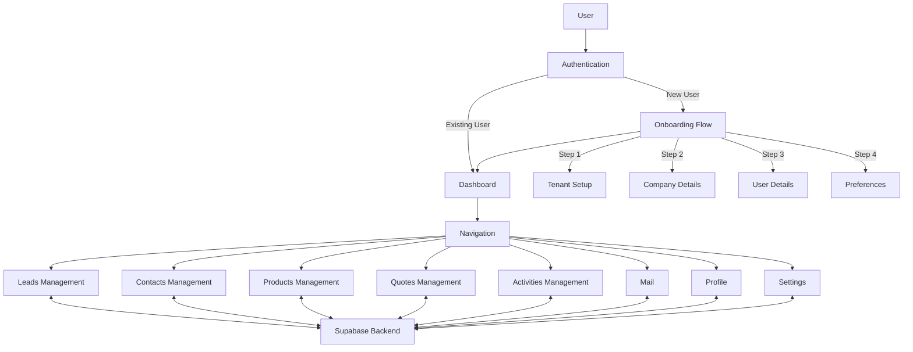
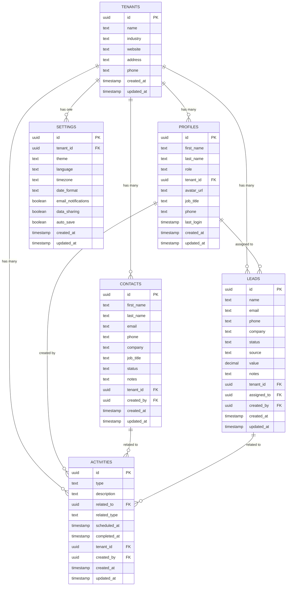
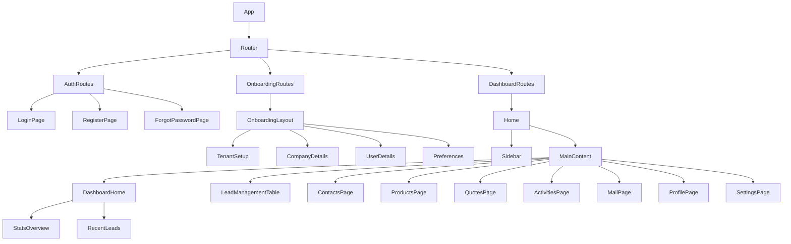
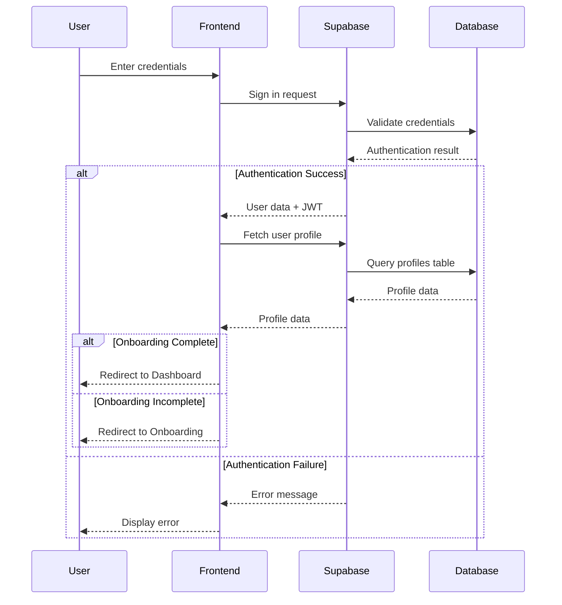
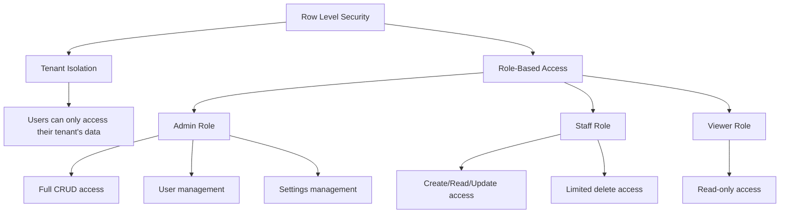

# Xalesin CRM Architecture Diagram

## Application Flow

```mermaid
graph TD
    A[User] --> B[Authentication]
    B -->|New User| C[Onboarding Flow]
    B -->|Existing User| D[Dashboard]
    
    C -->|Step 1| C1[Tenant Setup]
    C -->|Step 2| C2[Company Details]
    C -->|Step 3| C3[User Details]
    C -->|Step 4| C4[Preferences]
    C --> D
    
    D --> E[Navigation]
    E --> F1[Leads Management]
    E --> F2[Contacts Management]
    E --> F3[Products Management]
    E --> F4[Quotes Management]
    E --> F5[Activities Management]
    E --> F6[Mail]
    E --> F7[Profile]
    E --> F8[Settings]
    
    F1 <--> G[Supabase Backend]
    F2 <--> G
    F3 <--> G
    F4 <--> G
    F5 <--> G
    F6 <--> G
    F7 <--> G
    F8 <--> G
```

## Database Schema

```mermaid
erDiagram
    TENANTS ||--o{ PROFILES : "has many"
    TENANTS ||--o{ CONTACTS : "has many"
    TENANTS ||--o{ LEADS : "has many"
    TENANTS ||--o{ ACTIVITIES : "has many"
    TENANTS ||--o{ SETTINGS : "has one"
    
    PROFILES ||--o{ LEADS : "assigned to"
    PROFILES ||--o{ ACTIVITIES : "created by"
    
    CONTACTS ||--o{ ACTIVITIES : "related to"
    LEADS ||--o{ ACTIVITIES : "related to"
    
    TENANTS {
        uuid id PK
        text name
        text industry
        text website
        text address
        text phone
        timestamp created_at
        timestamp updated_at
    }
    
    PROFILES {
        uuid id PK
        text first_name
        text last_name
        text role
        uuid tenant_id FK
        text avatar_url
        text job_title
        text phone
        timestamp last_login
        timestamp created_at
        timestamp updated_at
    }
    
    CONTACTS {
        uuid id PK
        text first_name
        text last_name
        text email
        text phone
        text company
        text job_title
        text status
        text notes
        uuid tenant_id FK
        uuid created_by FK
        timestamp created_at
        timestamp updated_at
    }
    
    LEADS {
        uuid id PK
        text name
        text email
        text phone
        text company
        text status
        text source
        decimal value
        text notes
        uuid tenant_id FK
        uuid assigned_to FK
        uuid created_by FK
        timestamp created_at
        timestamp updated_at
    }
    
    ACTIVITIES {
        uuid id PK
        text type
        text description
        uuid related_to FK
        text related_type
        timestamp scheduled_at
        timestamp completed_at
        uuid tenant_id FK
        uuid created_by FK
        timestamp created_at
        timestamp updated_at
    }
    
    SETTINGS {
        uuid id PK
        uuid tenant_id FK
        text theme
        text language
        text timezone
        text date_format
        boolean email_notifications
        boolean data_sharing
        boolean auto_save
        timestamp created_at
        timestamp updated_at
    }
```

## Component Structure

```mermaid
graph TD
    App --> Router
    Router --> AuthRoutes
    Router --> OnboardingRoutes
    Router --> DashboardRoutes
    
    AuthRoutes --> LoginPage
    AuthRoutes --> RegisterPage
    AuthRoutes --> ForgotPasswordPage
    
    OnboardingRoutes --> OnboardingLayout
    OnboardingLayout --> TenantSetup
    OnboardingLayout --> CompanyDetails
    OnboardingLayout --> UserDetails
    OnboardingLayout --> Preferences
    
    DashboardRoutes --> Home
    Home --> Sidebar
    Home --> MainContent
    
    MainContent --> DashboardHome
    MainContent --> LeadManagementTable
    MainContent --> ContactsPage
    MainContent --> ProductsPage
    MainContent --> QuotesPage
    MainContent --> ActivitiesPage
    MainContent --> MailPage
    MainContent --> ProfilePage
    MainContent --> SettingsPage
    
    DashboardHome --> StatsOverview
    DashboardHome --> RecentLeads
```

## Authentication Flow

```mermaid
sequenceDiagram
    participant User
    participant Frontend
    participant Supabase
    participant Database
    
    User->>Frontend: Enter credentials
    Frontend->>Supabase: Sign in request
    Supabase->>Database: Validate credentials
    Database-->>Supabase: Authentication result
    
    alt Authentication Success
        Supabase-->>Frontend: User data + JWT
        Frontend->>Supabase: Fetch user profile
        Supabase->>Database: Query profiles table
        Database-->>Supabase: Profile data
        Supabase-->>Frontend: Profile data
        
        alt Onboarding Complete
            Frontend-->>User: Redirect to Dashboard
        else Onboarding Incomplete
            Frontend-->>User: Redirect to Onboarding
        end
    else Authentication Failure
        Supabase-->>Frontend: Error message
        Frontend-->>User: Display error
    end
```

## Data Security Model

```mermaid
graph TD
    A[Row Level Security] --> B[Tenant Isolation]
    A --> C[Role-Based Access]
    
    B --> B1[Users can only access their tenant's data]
    
    C --> C1[Admin Role]
    C --> C2[Staff Role]
    C --> C3[Viewer Role]
    
    C1 --> C1a[Full CRUD access]
    C1 --> C1b[User management]
    C1 --> C1c[Settings management]
    
    C2 --> C2a[Create/Read/Update access]
    C2 --> C2b[Limited delete access]
    
    C3 --> C3a[Read-only access]
```